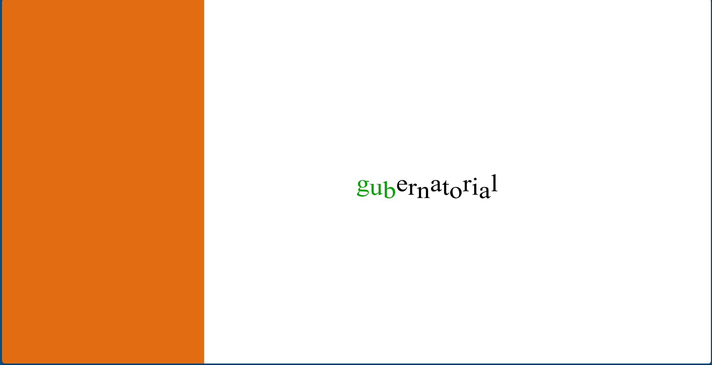

# My First JS Project!

This is my first web based project, and so is my first exposure to Javascript code. While I can't say I'm now an expert, I feel that this project has taught me a good amount about the web platform, and I hope I can apply what I've learned to more cool projects going forward.
# Premise
It's pretty simple, you must type the word shown to you before the timer runs out, but the game will try to hinder your comprehension of the word by throwing odd visual effects at you.
# To play
This game is playable on itch.io at [typing-game](https://theditheredbat.itch.io/typing-game), hope you enjoy!